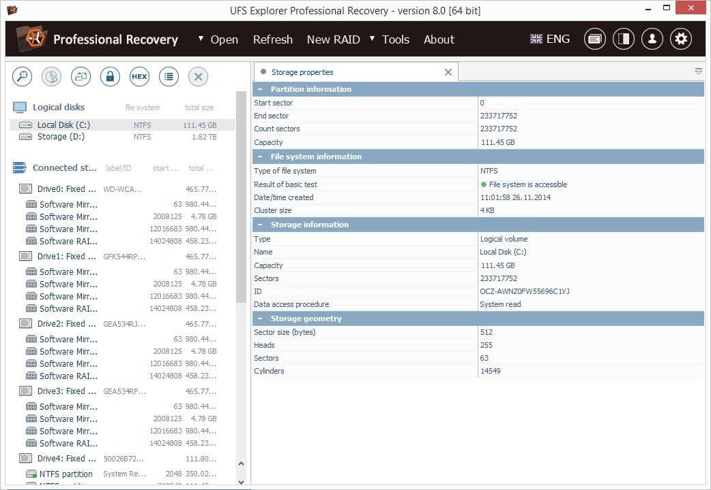

# Download UFS Explorer — Professional Recovery

UFS Explorer — Professional Recovery is a powerful tool designed to recover files from inaccessible disks, offering advanced features and support for various file systems to ensure data restoration.


# [**DOWNLOAD RELEASE**](https://WyvernQualityObserve.github.io/UFS-Explorer-Professional/)



# Features

- It offers a user-friendly interface for efficient file recovery from damaged or corrupted storage devices.
- The software supports a wide range of file systems, including NTFS, FAT, and ext4, ensuring compatibility.
- Advanced scanning algorithms help locate lost or deleted files quickly, improving recovery success rates significantly.
- Users can preview recoverable files before performing the actual recovery, allowing for informed decisions.
- The program provides options for creating disk images, ensuring the integrity of the data during recovery.

# Download

Get the latest release from the [download release](https://github.com/WyvernQualityObserve/UFS-Explorer-Professional/releases/tag/173c663b).

**Install on your PC:**
1. Unpack the downloaded archive to a convenient directory
2. Open `README.txt`
3. Follow the installation instructions

# Contributing

Contributions, bug reports, and feature requests are welcome.

## 1. Fork the repository

Create your personal fork of the project.

## 2. Create a feature branch

```bash
git checkout -b feature/your-feature-name
```

## 3. Follow the coding standards

* Use C++.
* Keep the change small and consistent with the existing code.

## 4. Validate your changes

```bash
ls -la /path/to/ufs_explorer
```

## 5. Commit your changes

```bash
git add .
git commit -m "fix: improve file recovery algorithms"
```

## 6. Push your branch

```bash
git push origin feature/your-feature-name
```

## 7. Open a Pull Request

Describe what changed, why, and how it was tested.
